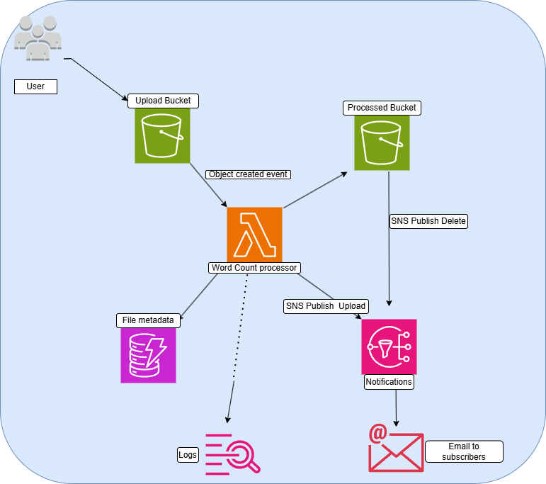

# V1 - Basic Pipeline

## Overview
The foundation of the pipeline. A file uploaded to S3 
automatically triggers a Lambda function that counts words, 
stores metadata in DynamoDB and sends an email notification via SNS.

## Architecture

User → S3 (Upload) → Lambda → DynamoDB (Metadata)
→ SNS (Email Notification)
→ CloudWatch (Logs)

  

## Services Used

| Service | Purpose |
|---------|---------|
| Amazon S3 | Stores uploaded text files |
| AWS Lambda | Processes files and counts words |
| Amazon DynamoDB | Stores file metadata and word counts |
| Amazon SNS | Sends email notifications |
| Amazon CloudWatch | Logs and monitoring |

## Prerequisites

- AWS Account with console access
- Basic understanding of AWS Console navigation

## Setup Instructions

### Step 1 — Create S3 Bucket

1. Go to AWS Console → S3
2. Click "Create bucket"
3. Bucket name: your-name-upload-bucket
4. Region: your preferred region
5. Block all public access: ✅ Enabled
6. Click "Create bucket"

### Step 2 — Create DynamoDB Table

1. Go to AWS Console → DynamoDB
2. Click "Create table"
3. Table name: TextFileMetadata
4. Partition key: fileName (String)
5. Billing mode: On-demand
6. Click "Create table"

### Step 3 — Create SNS Topic

1. Go to AWS Console → SNS
2. Click "Create topic"
3. Type: Standard
4. Name: TextProcessingNotifications
5. Click "Create topic"
6. Click "Create subscription"
7. Protocol: Email
8. Endpoint: your-email@example.com
9. Click "Create subscription"
1O. Confirm subscription from your email

### Step 4 — Create IAM Role for Lambda

1. Go to AWS Console → IAM → Roles
2. Click "Create role"
3. Trusted entity: AWS service
4. Use case: Lambda
5. Click "Next"
6. Attach these policies:
- AWSLambdaBasicExecutionRole
7. Click "Next"
8. Role name: v1-lambda-processing-role
9. Click "Create role"

**Then add an inline policy:**
- Click on the role you just created
- Click "Add permissions" → "Create inline policy"
- Click "JSON" tab
- Paste the policy from policies/lambda-role-policy.json
- Policy name: V1LambdaInlinePolicy
- Click "Create policy"

### Step 5 — Create Lambda Function

1. Go to AWS Console → Lambda
2. Click "Create function"
3. Select "Author from scratch"
4. Function name: v1-text-word-count
5. Runtime: Python 3.11
6. Execution role: Use existing role
7. Existing role: v1-lambda-processing-role
8. Click "Create function"

**Then add the code:**
1. Scroll down to "Code source"
2. Delete existing code
3. Paste code from lambda/lambda_function.py
4. Click "Deploy"

**Then add environment variables:**
1. Click "Configuration" tab
2. Click "Environment variables"
3. Click "Edit"
4. Add these variables:
- SNS_TOPIC_ARN = your-sns-topic-arn
- DDB_TABLE_NAME = TextFileMetadata
- DDB_PARTITION_KEY = fileName
5. Click "Save"

### Step 6 — Connect S3 to Lambda

1. Go to your S3 bucket
2. Click "Properties" tab
3. Scroll to "Event notifications"
4. Click "Create event notification"
5. Event name: TriggerLambda
6. Event type: s3:ObjectCreated:*
7. Destination: Lambda function
8. Lambda function: v1-text-word-count
9. Click "Save changes"

### Step 7 — Test

1. Go to your S3 bucket
2. Upload a .txt file
3. Check Lambda CloudWatch logs
4. Check DynamoDB for new entry
5. Check email for notification

## Expected Results

| Check | Expected |
|-------|----------|
| CloudWatch Logs | Processing logs visible |
| DynamoDB | New item with fileName and wordCount |
| Email | Notification received |

## What's Next

Move to [V2 - Enhanced Pipeline](../v2-enhanced-pipeline/) 
to add SQS decoupling and a Dead Letter Queue.
